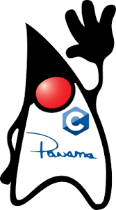

# Project Panama



Project Panama is another exciting initiative by the OpenJDK community. The main goal of Project Panama is to make it easier for Java developers to work with non-Java code, specifically C code. This is achieved by providing an efficient foreign function interface (FFI) and native interoperability.

**Goal**: Make working with non-Java code easier.

**How**? By allowing developers to directly call C code from Java. Without needing complex glue code.

* Provides an efficient foreign function interface (FFI) and native interoperability.
* Allows calling native C libraries directly from Java without JNI.
* Key goals are performance, ease of use, and safety.

**Benefits**: Work with existing C libraries easily. Avoid complex JNI code.

## Keep in mind those key concepts:

1. **`Foreign Function Interface (FFI)`**: FFI is a mechanism by which a program written in one programming language can call routines or make use of services written in another. In the context of Project Panama, it allows Java code to call C code directly.
2. **`Native Interoperability`**: This refers to the ability of Java to interact with native programming languages like C. Project Panama enhances this interoperability, making it easier and more efficient to use native libraries in Java.
3. **`JNI (Java Native Interface)`**: Before Project Panama, if you wanted to call C code from Java, you had to use JNI. However, JNI can be complex and difficult to use. Project Panama aims to provide a simpler and more efficient alternative.

Now, let's look at a simple example of how to use Project Panama in Java:

### Call C code from Java Old Way with JNI

```java
public class JNITest {
    public static void main(String[] args) {
        // Load the native library
        System.loadLibrary("mylib");

        // Call the native function
        nativeMethod();
    }

    // Declare the native method
    private static native void nativeMethod();
}
```

### Call C code from Java with Project Panama

```java
import jdk.incubator.foreign.*;

public class PanamaExample {
    public static void main(String[] args) {
        // Load the C library
        try (LibraryLookup lib = LibraryLookup.ofDefault()) {
            // Find a function in the C library
            LibraryLookup.Symbol puts = lib.lookup("puts").get();
            // Create a method handle for the function
            MethodHandle putsHandle = CLinker.getInstance().downcallHandle(
                puts, MethodType.methodType(int.class, MemoryAddress.class),
                FunctionDescriptor.of(CLinker.C_INT, CLinker.C_POINTER)
            );

            // Allocate memory for a C string
            try (MemorySegment cString = CLinker.toCString("Hello from C!", ResourceScope.newImplicitScope())) {
                // Call the C function
                int result = (int) putsHandle.invokeExact(cString.address());
                System.out.println("puts returned " + result);
            } catch (Throwable t) {
                t.printStackTrace();
            }
        }
    }
}
```

> In this example, we're loading a C library, finding a function in that library **(puts)**, and creating a method handle for that function. We then allocate memory for a C string and call the **puts** function with that string. The puts function prints the string to the console and returns the number of characters printed. 

> This is a very basic example, but it illustrates the core concepts of Project Panama. With Project Panama, we can call C code directly from Java, making it easier to work with native libraries and enhancing the capabilities of Java as a programming language.
