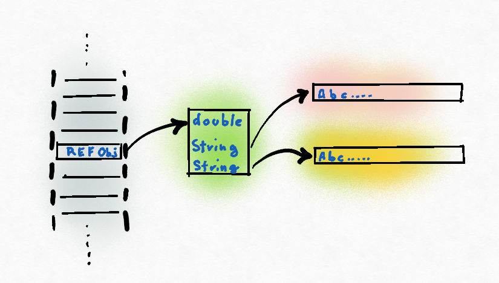

# Project Valhalla



The main goal of Project Valhalla is to introduce value types and generic specializations to the Java language, which can greatly improve both performance and memory efficiency.

**Goal**: Improve performance and memory efficiency.

* Aims to improve Java's type system and make the language more flexible.

**How**? By having new "value types" that avoid expensive memory allocations. And having "specialized" code that runs faster for specific cases.

**Benefits**: Faster code execution. Reduced memory usage.

## Keep in mind those key concepts:

1. **`Value Types`**: Value types are a new kind of type in Java, which are meant to be a more efficient alternative to objects for encapsulating data. Unlike objects, value types do not have an identity and their equality is based on their state, not on their identity. This can lead to more efficient memory usage and faster execution times.
2. **`Generic Specializations`**: Generic specializations allow you to write generic code that can be specialized for specific types. This can lead to more efficient code because the JVM can optimize the code for the specific types that are used.

Here's an example of how you might use value types and generic specializations in Java:

```java
// Value Type Example
record Point(int x, int y) {} // This is a value type that encapsulates a point in 2D space

// Generic Specialization Example
public class SpecializedList<E> {
    private E[] elements;

    @Specialization(on = 0)
    public E get(int index) {
        // This is a specialized version of the get method for the case where index is 0
        return elements[0];
    }

    @Specialization
    public E get(int index) {
        // This is the general version of the get method
        return elements[index];
    }
}
```

> In the first part of the example, we define a value type **Point** that encapsulates a point in 2D space. This value type is more efficient than an equivalent class because it does not have an identity and its memory layout is more efficient.

> In the second part of the example, we define a class **SpecializedList** with a generic type parameter E. This class has a method **get** that is specialized for the case where the index is 0. This means that if you call **get(0)**, the JVM will call the specialized version of the method, which can be more efficient than the general version.

> Project Valhalla is still in the experimental stage, but it promises to bring significant improvements to the performance and memory efficiency of Java code. It's definitely a project to keep an eye on if you're interested in the future of Java.
