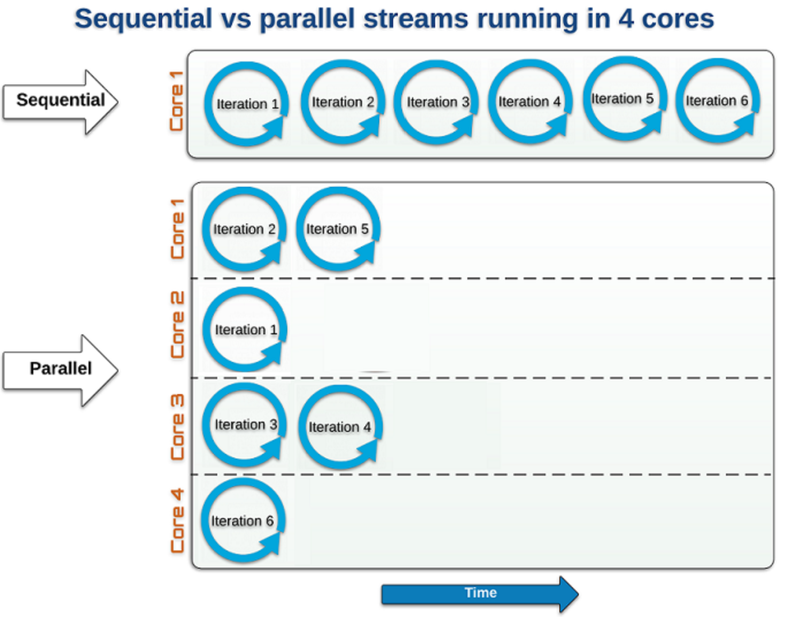

# Java 8 Features (LTS)

* Java 8 is the first version of Java that supports functional programming.
* It comes with with declarative approach instead of imperative approach which gives more flexibility to the programmer by avoiding verbosity.

## 1. Functional Interface

* Functional Interface in java 8 is an interface that has only one abstract method.
* Link to [Functional Interface documentation](https://docs.oracle.com/javase/8/docs/api/java/util/function/package-summary.html)

### 1.1 Predicate

* Predicate is a functional interface that takes **one argument** and **returns a boolean** value (true / false).

```java
Predicate<Player> isPlayerFromMorocco = player -> player.getCountry().equals("Morocco");

List<Player> moroccanPlayers = players.stream()
        .filter(isPlayerFromMorocco)
        .collect(Collectors.toList());

moroccanPlayers.forEach(System.out::println);
```

### 1.2 Function<>

* Function is a functional interface that takes **one argument** and produces a result.

```java
// Example 1

static Function<Player, String> playerToName = Player::getName;

String name = playerToName.apply("Messi 🐐");

// Example 2

Function<Integer, Integer> square = x -> x * x;
int result = square.apply(5);

Function<Integer, Integer> squareAndThenAddOne = square.andThen(x -> x + 1);
int finalResult = squareAndThenAddOne.apply(5);
```

### 1.3 BiFunction<>

* BiFunction is a functional interface that takes **two arguments** and produces a result.

```java
BiFunction<Integer, Integer, Integer> multiplyByEightAndThenAddNumber = (x, y) -> (x * 8) + y;

int result = multiplyByEightAndThenAddNumber.apply(5, 10);
```

### 1.4 Consumer<>

* Consumer is a functional interface that takes **one argument** and **returns nothing**.

```java
Consumer<Player> Helloplayer = player -> {
    System.out.println("Hello Everyone ! " + player.getName());
};

playerList.accept(player);
```

### 1.5 BiConsumer<>

* BiConsumer is a functional interface that takes **two arguments** and **returns nothing**.

```java
BiConsumer<Player, Boolean> playerList = (player, showName) -> {
    System.out.println("Hello Everyone ! " + player.getName());
    showPlayerName ? player.getName() : " ***** Player List For The Game Not Ready Yet ***** ";
};

playerList.accept(player, true);
```

### 1.6 Supplier<>

* Supplier is a functional interface that takes **no argument** and **returns a result**, it's like a getter.

```java
Supplier<String> getDockerImagesForTheApp = () -> {
    List.of(
        "docker pull mysql:latest",
        "docker pull redis:latest",
        "docker pull postgres:latest",
        "docker pull nginx:latest",
        "docker pull node:latest",
        "docker pull openjdk:latest"
    )
};

getDockerImagesForTheApp.get();
```

## 2. Stream API

* Stream API is a new feature in Java 8 that allows us to **process data** in a **declarative way**.
* It allows us to perform filter, map, reduce, find, match, sort, and many other operations with the collection of data.
* We process data in a functional programming style in 3 steps:
  1. It starts with a collection of data :
     * List
     * Set
     * Map
     * Array
     * etc.
  2. It applies a series of operations on the data.
  3. It produces a result.


```java
// List of premier league clubs (1st division in England)
List<String> premierLeagueClubs = List.of(
    "Manchester United",
    "Manchester City",
    "Liverpool",
    "Chelsea",
    "Arsenal",
    "Tottenham Hotspur",
    "..." // 19 other clubs
);

// Filter in Stream API
List<String> premierLeagueClubsStartingWithLetterM = premierLeagueClubs.stream()
    .filter(club -> club.startsWith("M"))
    .collect(Collectors.toList());

premierLeagueClubsStartingWithLetterM.forEach(System.out::println);
```

* There is a bunch of other operations that we can apply on the data:
  * **filter()** : filters the data based on a condition.
  * **map()** : maps the data to another object.
  * **sorted()** : sorts the data.
  * **collect()** : collects the output and returns a list.
  * **reduce()** : reduces the elements to a single value.
  * **count()** : returns the count of elements in the stream.
  * **min()** : returns the minimum element of the stream.
  * **max()** : returns the maximum element of the stream.
  * **findAny()** : returns any element of the stream.
  * **findFirst()** : returns the first element of the stream.
  * **allMatch()** : returns true if all elements of the stream match the given predicate.
  * **anyMatch()** : returns true if any of the elements of the stream match the given predicate.
* **Parallel Stream** : Parallel stream is used to process data in parallel. It is faster than sequential stream.



```java
List<String> premierLeagueClubs = List.of(
    "Manchester United",
    "Manchester City",
    "Liverpool",
    "Chelsea",
    "Arsenal",
    "Tottenham Hotspur",
    "..." // 19 other clubs
);

List<String> premierLeagueClubsStartingWithLetterM = premierLeagueClubs.parallelStream()
    .filter(club -> club.startsWith("M"))
    .collect(Collectors.toList());

premierLeagueClubsStartingWithLetterM.forEach(System.out::println);
```

## 3. Optional

* Optional is a container object which may or may not contain a non-null value.
* It aims to **solve** the problem of **NullPointerException** in Java by avoiding the null value and generating exception or message to use.

```java
Optional<String> optional = Optional.ofNullable(null);
    .orElseGet(() -> "Default value"); // Default value

Optional<String> sendEmailIfPresent = Optional.ofNullable("nano@gmail.com").ifPresent(email -> sendEmail(email)); // Send email

Optional<String> sendEmailIfPresentOrElse = Optional.ofNullable("nano@gmail.com").ifPresentOrElse(
    email -> sendEmail(email),
    () -> System.out.println("Email not found")
); 
```

## 4. CallBacks

* Callbacks are used to **execute** a function after a task is completed.

```java
static void greet(String name, int age, Callback callback) {
    System.out.println("Hello " + name + " !");

    if (age < 18) {
        System.out.println("You are not allowed to enter the club");
    } else {
        callback.accept("Welcome to the club");
    }
}
```

## 5. Lambda Expression

* Lambda expression is a **short block of code** which takes in parameters and returns a value.

```java
// Without lambda expression
Runnable runnable = new Runnable() {
    @Override
    public void run() {
        System.out.println("Hello World !");
    }
};

// With lambda expression
Runnable runnable = () -> System.out.println("Hello World !");
```

## 6. Date and Time API

* Java 8 introduced a new date and time API to deal with date and time in Java.

```java
// Get current date and time
LocalDateTime now = LocalDateTime.now();

// Get current date
LocalDate today = LocalDate.now();

// Get current time
LocalTime time = LocalTime.now();

// Get current date and time in UTC
ZonedDateTime utc = ZonedDateTime.now(ZoneId.of("UTC"));

// Get current date and time in Paris
ZonedDateTime paris = ZonedDateTime.now(ZoneId.of("Europe/Paris"));

```
